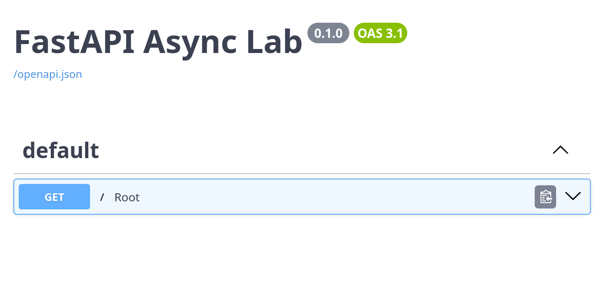
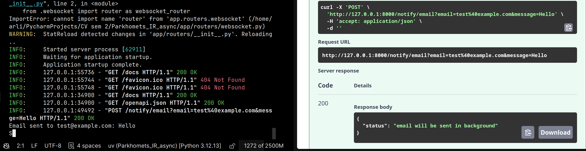
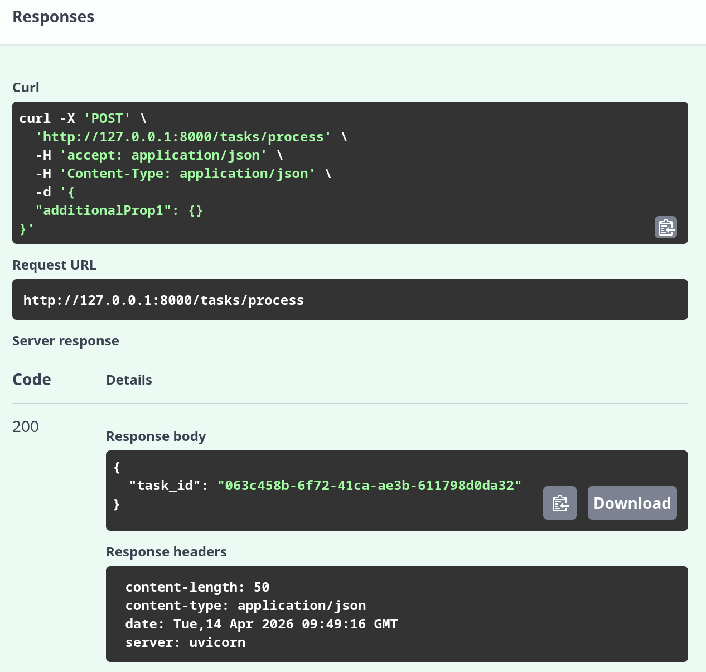
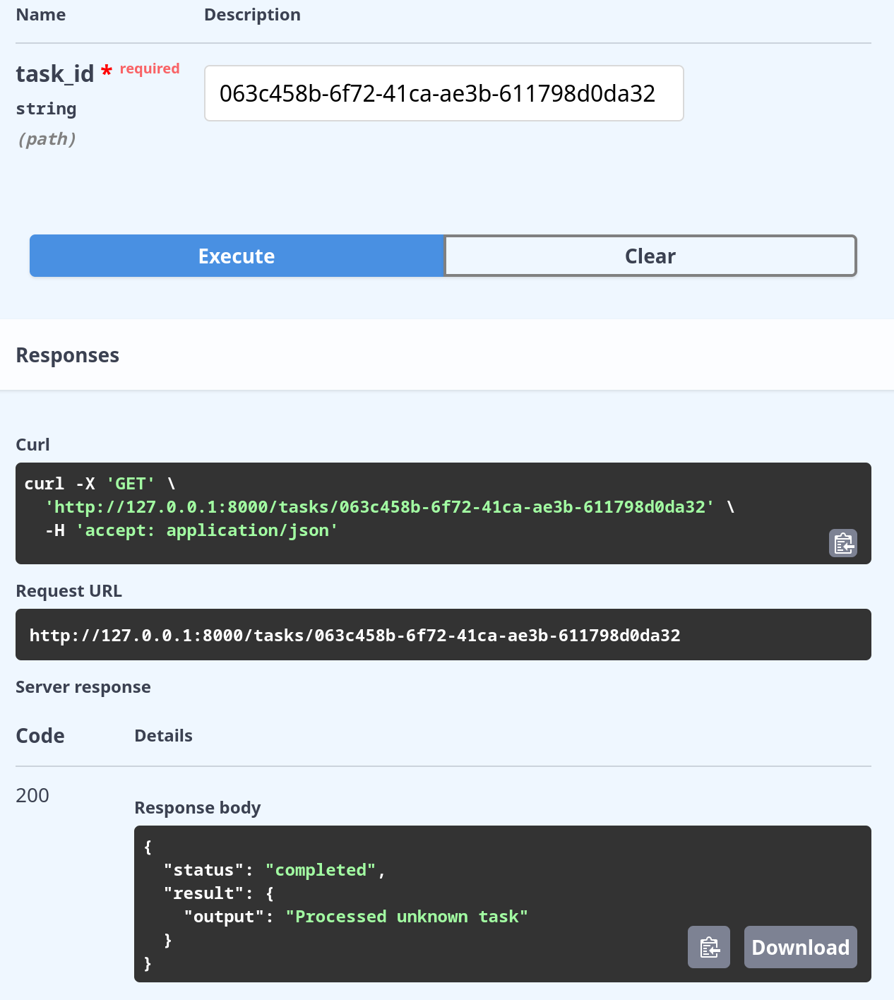
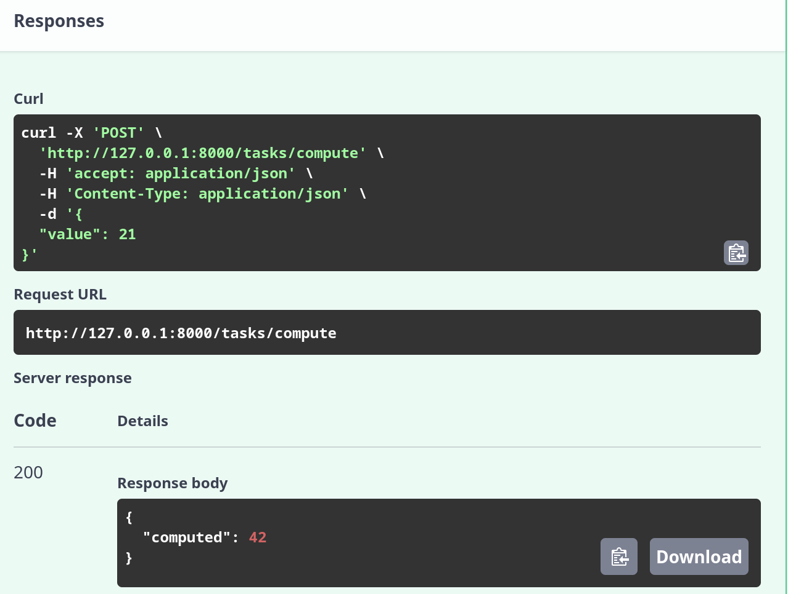
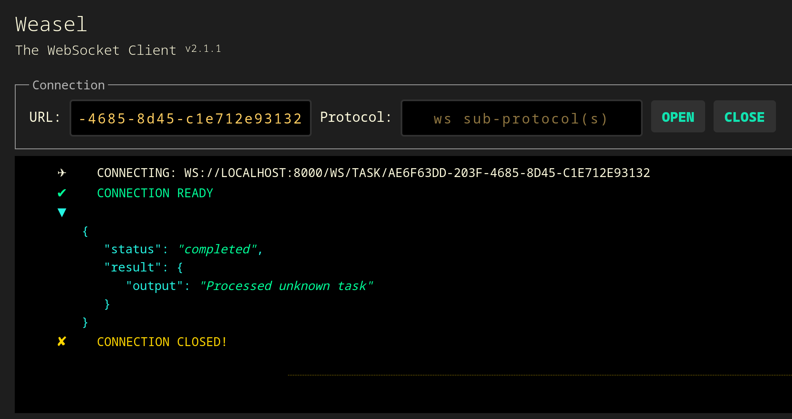
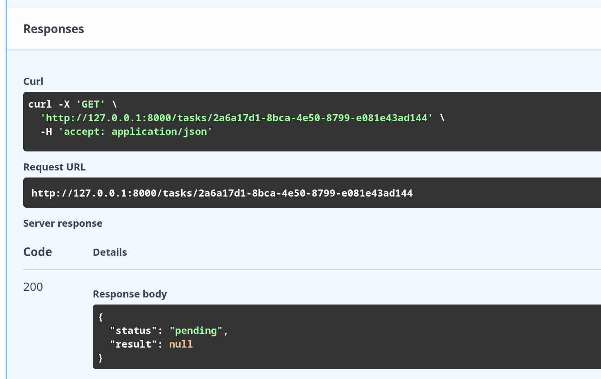
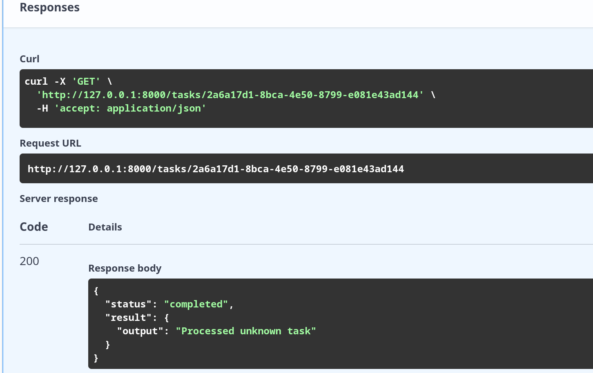

# Задание 1

Все успешно работает
# Задание 2

Ответ пришел моментально, в консоли с заданной задержкой в 2 секунды
# Задание 3
Сначала создаем таск

Получаем его айдишник и смотрим по нему результат

# Задание 4
Тут все тоже усешно работает

# Задание 5
Веб-сокет успешно работает

# Задание 6.1
Создал кучу таксков, по последнему посмотрел его статусы

Сначала он был в статусе pending, а после выполнения стал completed

